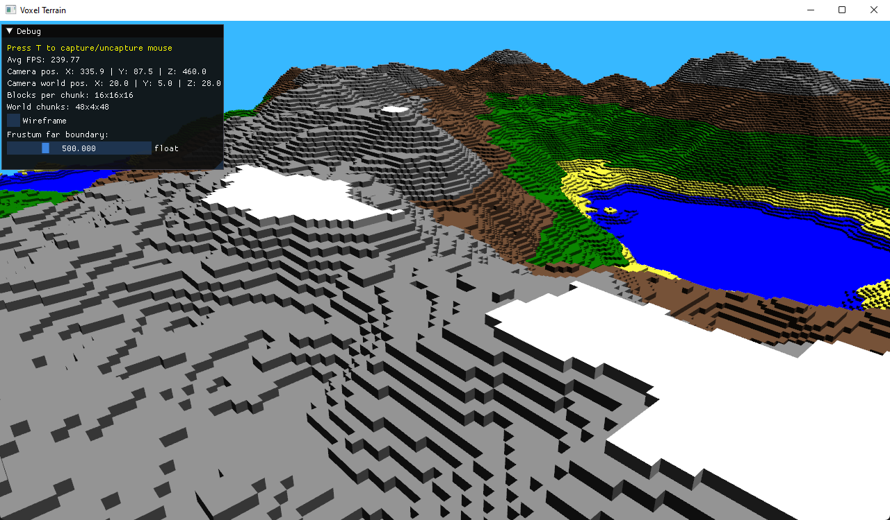

# Infinite procedural terrain in voxel
A simple infinite procedural terrain generator with voxels using C++ and OpenGL 3.3.  
It uses [Dear ImGui](https://github.com/ocornut/imgui) to create a debug window, [libnoise](https://libnoise.sourceforge.net/) with Perlin Noise to generate heightmaps, polygons to create the mesh and a hashmap to store and manipulate chunks.  

## Prerequisites
- GPU with OpenGL 3.3 compatibility
- Visual Studio 2022
- x64 OS

## Usage
- Open `voxel-engine.sln`
- Select `Release` mode with `x64` and then: 
	- Select `Build Solution` to generate an executable inside `voxel-engine/x64/release/` OR
	- Select `Run` to build and run the application inside the IDE
- For other than Windows, you might need to rebuild libs inside `common`

## License
- This project is MIT licensed